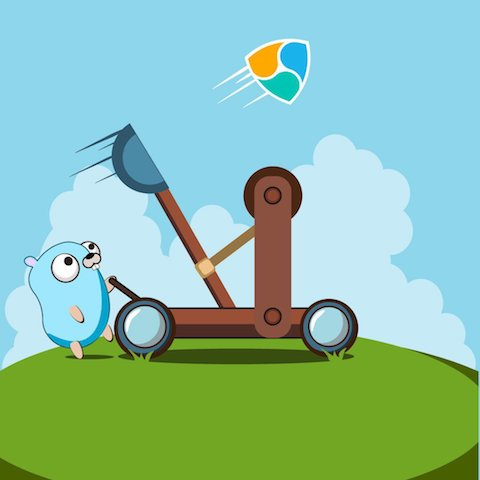

# nem2-sdk-go

nem2-sdk-go is a Golang client library for Catapult API


<p align="center"> 
    
</p>

## Usage ##

```go
import "github.com/proximax-storage/nem2-sdk-go/sdk"
```

Create a Catapult network configuration 

Using the *Testnet* network
```go
conf, err := sdk.NewConfig("http://localhost:3000",sdk.Testnet)
```
Or using the *Mainnet* network
```go
conf, err := sdk.NewConfig("http://localhost:3000",sdk.Mainnet)
```

Construct a new Catapult client
```go
client := sdk.NewClient(nil, conf)
```

Using the client to call a method from a Service API

```go
// Get the chain height
chainHeight, resp, err := client.Blockchain.GetChainHeight(context.Background())
```

## Context ##

A [Context](https://golang.org/pkg/context/) type is the first argument in any service method for specifying
deadlines, cancelation signals, and other request-scoped values
```go
// Get the chain height
chainHeight, resp, err := client.Blockchain.GetChainHeight(context.Background())
```

## Wiki / Examples ##

Examples are in the `examples` folder

For more examples, go to our [wiki](https://github.com/proximax-storage/nem2-sdk-go/wiki)

## Core Contributors ##

 + [@Wondertan](https://github.com/Wondertan) 
 + [@ruslanBik4](https://github.com/ruslanBik4)
 + [@slackve](https://github.com/slackve)
 + [@brambear](https://github.com/alvin-reyes)
 + [@carlocayos](https://github.com/carlocayos)

## Contribution ##
We'd love to get more people involved in the project. Please feel free to raise any issues or PR and we'll review your contribution.

Copyright (c) 2018 ProximaX Limited
